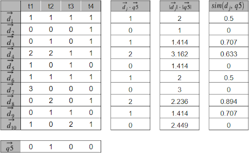

TDT4117 Information Retrieval - Autumn 2021\
Alexander Høyby\
Bjørn Are Odden
# Assignment 1

**Note:** Use log base 2 for all your computations.

 

## Task 1: Basic Definitions

Explain the main differences between:

1\. Information Retrieval vs Data Retrieval \
The main difference is that **information retrieval** mainly focuses on providing information about a certain topic or subject from a natural language query. The IR system has to take into account inaccuracy in the choice of terms in the query provided by the user, but also considers context and is therefore willing to apply different methods such as using synonyms for certain query terms in order to provide a more precise result.

**Data retrieval** on the other hand is more concerned about providing a collection of documents where the keywords match exactly the terms provided in the query. The data queried has a well defined structure and will provide exactly what you ask for in terms of data. A relational database is an example of this kind of system.

 

2\. Structured Data vs Unstructured Data

An example of **structured data** would be the records for a library, or rows in a database table, which conforms to a specified format which allows it to be queried and/or matched exactly (using data retrieval). This is different from the actual text content of the document that the record is pointing towards. The text content across different documents cannot conform to one specific format, as that would change the meaning, which in turn means that we cannot query this in the same way as we do for structured data.

 

## Task 2: Term Weighting

Explain:

1\. Term Frequency (tf) \
**Term frequency** is simply how many times a certain term occurs in a document. This does not however, tell us anything about how relevant the document is (10 times more occurrences does not mean 10 times more relevant). We therefore often apply log frequency weighting to lower the ratio.

 

2\. Document Frequency (df) \
**Document frequency** is the number of documents (in the given collection) containing the term. The term frequency for a specific document does not influence the document frequency, only whether the term occurs at least once. Then it follows that the document frequency will always be less than the collection frequency of the same term.

 

3\. Inverse Document Frequency (idf) \
**Inverse document frequency** applies a mathematical expression to give frequent terms a high score, but an even higher score for rare but descriptive terms.

A thing to think about here is that stop words (the, be, to), will most of the time be the most common words (unless stopword removal has been performed).

 

4\. Why idf is important for term weighting \
**Idf is important** for term weighting as these kinds of terms introduce a good discimination value, and will be of good use in providing a more relevant result.

As mentioned above idf will make sure that common words that provide little- to no real discimination value are scored lower.

 

## Task 3: IR Models

Given the following document collection containing words from the set O = {Big, Cat, Small, Dog}, answer the questions in subtasks 3.1 and 3.2.

doc1 = {Big Cat Small Dog}

doc2 = {Dog}

doc3 = {Cat Dog}

doc4 = {Big Cat Big Small Cat Dog}

doc5 = {Big Small}

doc6 = {Small Cat Dog Big }

doc7 = {Big Big Big}

doc8 = {Dog Cat Cat }

doc9 = {Cat Small }

doc10 = {Small Small Big Dog}

 

### SubTask 3.1: Boolean Model and Vector Space Model

Given the following queries:

q1 = "Cat AND Dog"

q2 = "Cat AND Small"

q3 = "Dog OR Big"

q4 = "Dog NOT Small"

q5 = "Cat"

 

1\. Which of the documents will be returned as the result for the above queries using the Boolean model? Explain your answers and draw a figure to illustrate.

q1	-	doc1, doc3, doc4, doc6, doc8 as “Cat” and “Dog” are both present.\
q2	-	doc1, doc4, doc6, doc9 as “Cat” and “Small” are both present.\
q3	-	doc1, doc2, doc3, doc4, doc5, doc6, doc7, doc8, doc10 as either “Dog” or “Big” is present.\
q4	- 	doc2, doc3, doc8 as “Dog” is present, while “Small” is not.\
q5	-	doc1, doc3, doc4, doc6, doc8, doc9 as “Cat” is present.

<table>
  <tr>
   <td>
   </td>
   <td>doc1
   </td>
   <td>doc2
   </td>
   <td>doc3
   </td>
   <td>doc4
   </td>
   <td>doc5
   </td>
   <td>doc6
   </td>
   <td>doc7
   </td>
   <td>doc8
   </td>
   <td>doc9
   </td>
   <td>doc10
   </td>
  </tr>
  <tr>
   <td>q1
   </td>
   <td>1
   </td>
   <td>0
   </td>
   <td>1
   </td>
   <td>1
   </td>
   <td>0
   </td>
   <td>1
   </td>
   <td>0
   </td>
   <td>1
   </td>
   <td>0
   </td>
   <td>0
   </td>
  </tr>
  <tr>
   <td>q2
   </td>
   <td>1
   </td>
   <td>0
   </td>
   <td>0
   </td>
   <td>1
   </td>
   <td>0
   </td>
   <td>1
   </td>
   <td>0
   </td>
   <td>0
   </td>
   <td>1
   </td>
   <td>0
   </td>
  </tr>
  <tr>
   <td>q3
   </td>
   <td>1
   </td>
   <td>1
   </td>
   <td>1
   </td>
   <td>1
   </td>
   <td>1
   </td>
   <td>1
   </td>
   <td>1
   </td>
   <td>1
   </td>
   <td>0
   </td>
   <td>1
   </td>
  </tr>
  <tr>
   <td>q4
   </td>
   <td>0
   </td>
   <td>1
   </td>
   <td>1
   </td>
   <td>0
   </td>
   <td>0
   </td>
   <td>0
   </td>
   <td>0
   </td>
   <td>1
   </td>
   <td>0
   </td>
   <td>0
   </td>
  </tr>
  <tr>
   <td>q5
   </td>
   <td>1
   </td>
   <td>0
   </td>
   <td>1
   </td>
   <td>1
   </td>
   <td>0
   </td>
   <td>1
   </td>
   <td>0
   </td>
   <td>1
   </td>
   <td>1
   </td>
   <td>0
   </td>
  </tr>
</table>

1\. What is the dimension of the vector space representing this document collection when you use the vector model and how is it obtained? \
From the set of terms O = {Big, Cat, Small, Dog} we find that the dimension of the vector space representing this document collection is |O| = 4

3\. Calculate the weights for the documents and the terms using tf and idf weighting. Put these values into a document-term-matrix. **Tip:** TF-IDF weighting is the **product **of tf and idf values,  here each is calculated as follows.

 

fi,j = frequency of a term (i), in a document (j)

<table>
  <tr>
   <td>Term:
   </td>
   <td>fi,1
   </td>
   <td>fi,2
   </td>
   <td>fi,3
   </td>
   <td>fi,4
   </td>
   <td>fi,5
   </td>
   <td>fi,6
   </td>
   <td>fi,7
   </td>
   <td>fi,8
   </td>
   <td>fi,9
   </td>
   <td>fi,10
   </td>
  </tr>
  <tr>
   <td>Big
   </td>
   <td>1
   </td>
   <td>0
   </td>
   <td>0
   </td>
   <td>2
   </td>
   <td>1
   </td>
   <td>1
   </td>
   <td>3
   </td>
   <td>0
   </td>
   <td>0
   </td>
   <td>1
   </td>
  </tr>
  <tr>
   <td>Cat
   </td>
   <td>1
   </td>
   <td>0
   </td>
   <td>1
   </td>
   <td>2
   </td>
   <td>0
   </td>
   <td>1
   </td>
   <td>0
   </td>
   <td>2
   </td>
   <td>1
   </td>
   <td>0
   </td>
  </tr>
  <tr>
   <td>Small
   </td>
   <td>1
   </td>
   <td>0
   </td>
   <td>0
   </td>
   <td>1
   </td>
   <td>1
   </td>
   <td>1
   </td>
   <td>0
   </td>
   <td>0
   </td>
   <td>1
   </td>
   <td>2
   </td>
  </tr>
  <tr>
   <td>Dog
   </td>
   <td>1
   </td>
   <td>1
   </td>
   <td>1
   </td>
   <td>1
   </td>
   <td>0
   </td>
   <td>1
   </td>
   <td>0
   </td>
   <td>1
   </td>
   <td>0
   </td>
   <td>1
   </td>
  </tr>
</table>

 

tfi,j = 1 + log2(fi,j)

<table>
  <tr>
   <td>Term:
   </td>
   <td>tfi,1
   </td>
   <td>tfi,2
   </td>
   <td>tfi,3
   </td>
   <td>tfi,4
   </td>
   <td>tfi,5
   </td>
   <td>tfi,6
   </td>
   <td>tfi,7
   </td>
   <td>tfi,8
   </td>
   <td>tfi,9
   </td>
   <td>tfi,10
   </td>
  </tr>
  <tr>
   <td>Big
   </td>
   <td>1
   </td>
   <td>-
   </td>
   <td>-
   </td>
   <td>2
   </td>
   <td>1
   </td>
   <td>1
   </td>
   <td>2.58
   </td>
   <td>-
   </td>
   <td>-
   </td>
   <td>1
   </td>
  </tr>
  <tr>
   <td>Cat
   </td>
   <td>1
   </td>
   <td>-
   </td>
   <td>1
   </td>
   <td>2
   </td>
   <td>-
   </td>
   <td>1
   </td>
   <td>-
   </td>
   <td>2
   </td>
   <td>1
   </td>
   <td>-
   </td>
  </tr>
  <tr>
   <td>Small
   </td>
   <td>1
   </td>
   <td>-
   </td>
   <td>-
   </td>
   <td>1
   </td>
   <td>1
   </td>
   <td>1
   </td>
   <td>-
   </td>
   <td>-
   </td>
   <td>1
   </td>
   <td>2
   </td>
  </tr>
  <tr>
   <td>Dog
   </td>
   <td>1
   </td>
   <td>1
   </td>
   <td>1
   </td>
   <td>1
   </td>
   <td>-
   </td>
   <td>1
   </td>
   <td>-
   </td>
   <td>1
   </td>
   <td>-
   </td>
   <td>1
   </td>
  </tr>
</table>

 

IDFt = log2(N / dft) \
N = 10

<table>
  <tr>
   <td>Term:
   </td>
   <td>dft
   </td>
   <td>IDFt
   </td>
  </tr>
  <tr>
   <td>Big
   </td>
   <td>6
   </td>
   <td>0.737
   </td>
  </tr>
  <tr>
   <td>Cat
   </td>
   <td>6
   </td>
   <td>0.737
   </td>
  </tr>
  <tr>
   <td>Small
   </td>
   <td>6
   </td>
   <td>0.737
   </td>
  </tr>
  <tr>
   <td>Dog
   </td>
   <td>7
   </td>
   <td>0.515
   </td>
  </tr>
</table>

 

TF-IDF = tf * idf

<table>
  <tr>
   <td>Term:
   </td>
   <td>d1
   </td>
   <td>d2
   </td>
   <td>d3
   </td>
   <td>d4
   </td>
   <td>d5
   </td>
   <td>d6
   </td>
   <td>d7
   </td>
   <td>d8
   </td>
   <td>d9
   </td>
   <td>d10
   </td>
  </tr>
  <tr>
   <td>Big
   </td>
   <td>0.737
   </td>
   <td>-
   </td>
   <td>-
   </td>
   <td>1.474
   </td>
   <td>0.737
   </td>
   <td>0.737
   </td>
   <td>1.901
   </td>
   <td>-
   </td>
   <td>-
   </td>
   <td>0.737
   </td>
  </tr>
  <tr>
   <td>Cat
   </td>
   <td>0.737
   </td>
   <td>-
   </td>
   <td>0.737
   </td>
   <td>1.474
   </td>
   <td>-
   </td>
   <td>0.737
   </td>
   <td>-
   </td>
   <td>1.474
   </td>
   <td>0.737
   </td>
   <td>-
   </td>
  </tr>
  <tr>
   <td>Small
   </td>
   <td>0.737
   </td>
   <td>-
   </td>
   <td>-
   </td>
   <td>0.737
   </td>
   <td>0.737
   </td>
   <td>0.737
   </td>
   <td>-
   </td>
   <td>-
   </td>
   <td>0.737
   </td>
   <td>1.474
   </td>
  </tr>
  <tr>
   <td>Dog
   </td>
   <td>0.515
   </td>
   <td>0.515
   </td>
   <td>0.515
   </td>
   <td>0.515
   </td>
   <td>-
   </td>
   <td>0.515
   </td>
   <td>-
   </td>
   <td>0.515
   </td>
   <td>-
   </td>
   <td>0.515
   </td>
  </tr>
</table>

1\. Study the documents 2, 3, 5 and 7 and compare them to document 9. Calculate the similarity between document 9 and these four documents according to Euclidean distance. (Use _tf-idf_ weights for your computations). \

Euclidean distance = 

\
\
\

1\. Rank the documents for query q5 using cosine similarity.

q5 = "Cat" 

Example calculation using d1 an an example:

### SubTask 3.2: Probabilistic Models

Given the following queries:

q1 = "Cat Dog"

q2 = "Small"

1\. What are the main differences between BM25 model and the probabilistic model introduced by Robertson-Jones?\
The probabilistic model is a framework for estimating whether a document is related to a given query. It is dependent on *something* to give it the initial set of documents, in which the user can inspect. With feedback from the user, the estimate can be refined, and even further by repeating. The weak points for the model as a standalone is how to choose the initial set of documents and the assumption that terms are independent, which is remedied by BM25. It builds on the framework of the probabilistic model, where one of the improvements is that it does not need the relevance information as input. Another difference is that BM25 uses three features of the vector space model, term frequency, document length normalization and inverse document frequency, whereas the probabilistic model only uses idf.

2\. Rank the documents using the BM25 model. Set the parameters to k = 1.2 and b = 0.75. (Here we assume relevance information is not provided.) \
**Hint**: To avoid getting negative numbers, you need to use in the BM25 model.

Using the formula from last years slideset: 

 

 

 

 

 

 

 

 

For doc5 and doc7, the score is 0, as both terms are missing.\
For doc6, the case is as for doc1, as both terms have the same frequency with the same document length.

 

**Ranking for q1:** doc8, doc3, doc4, [doc1, doc6], doc9, doc2, doc10

 

 

 

 

For doc2, doc3, doc7 and doc8 the score is 0, as the term is missing\
The score for doc6 is the same as for doc1, also score for doc9 to doc5, as both term frequency and document length is the same

**Ranking for q2:** doc10, [doc5, doc9], [doc1, doc6], doc4