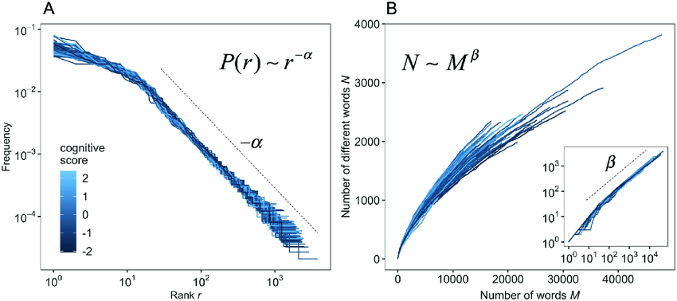

# Information retrieval:

## Chapters:

1. [_Introduction_](#c0)
   1. [_High level Architecture_](#c1)
2. [_Modeling_](#c2)
   1. [_IR Models_](#c3)
   2. [_Weighting_](#c4)
   3. [_Boolean model_](#c5)
   4. [_Vector Space model_](#c6)
   5. [_Probabilistic model_](#c7)
   6. [_Alternative Probabilistic Models_](#c8)
      1. [_BM25_](#c9)
      2. [_Language Model_](#c10)
3. [_Retrieval Evaluation_](#c11)
   1. [_Precision & Recall_](#c12)
4. [_Relevance Feedback and Query Expansion_](#c13)
5. [_Text Operation_](#c14)
6. [_Indexing and Searching_](#c15)
7. [_Web Retrieval_](#c16)
8. [_Multimedia Information Retrieval_](#c17)
   1. [_Image Retrieval_](#c18)
   2. [_Video Retrieval_](#c19)
   3. [_Audio Retrieval_](#c20)

## Assignments:

- [x] [Øving 1](https://github.com/Hoyby/NTNU/tree/master/TDT4117-InfoRet/Assignment_1)
- [x] [Øving 2](https://github.com/Hoyby/NTNU/tree/master/TDT4117-InfoRet/Assignment_2)
- [x] [Øving 3](https://github.com/Hoyby/NTNU/tree/master/TDT4117-InfoRet/Assignment_3)
- [x] [Øving 4](https://github.com/Hoyby/NTNU/tree/master/TDT4117-InfoRet/Assignment_4)
- [ ] [Øving 5](https://github.com/Hoyby/NTNU/tree/master/TDT4117-InfoRet/Assignment_5)

</br></br></br>

# Introduction <a name="c1"></a>

Information Retrieval is a field of computer science that deals with the retrieval of information from a large collection of documents. The field is often used in the context of search engines, which are used to find relevant documents for a user’s query and information need.

Information retrieaval includes retrieval of information in documents, Web pages, online catalogs, structured and semi-structured records and multimedia objects like pictures, videos, music, voicerecordings, etc. And the main **goal** is to maximize the number of relevant documents returned while minimizing the number of irrelevant documents returned. Due to the nature of languages this might requre the use of synonyms and other methods to find the best match and satisfy the user.

It is important to differenciate between information retrieval and data retrieval:

**_Information Retrieval:_** the process of retrieving information form a collection of data. The data is often unstructured and therefore requires fuzzy matching and will return a list of relevant documents.

**_Data Retrieval:_** the process of retrieving data from a data source. This data is stored in a structured form in a database and therefore requires exact queries that will return exact matches.

> **_!Exam question_** - describe the difference between Information Retrieval and Data Retrieval.

The **differences** in properties between data retrieval and information retrieval:

|      **Type**       | **Data retrieval** | **Information retrieval** |
| :-----------------: | :----------------: | :-----------------------: |
|       Content       |        Data        |        Information        |
|     Data object     |       Table        |         Document          |
|      Matching       |       Exact        |          Partial          |
|    Items wanted     |      Matching      |         Relevant          |
|   Query language    |     Artificial     |          Natural          |
| Query specification |      Complete      |        Incomplete         |
|        Model        |   Deterministic    |       Probabilistic       |
|      Structure      |        High        |           Less            |

## High level Architecture <a name="c1"></a>

Elements of a IR-system:

- Document collection
- Crawler (if this is a Web collection)
- Indexer
- Retrieval and ranking process
  - Query parsing and expansion
  - System query
  - Retrieval and ranking

TODO: insert image

A users interaction with the system is either in the form of retrieval or browsing.\
The retrieval process consists of retrieving documents that satisfy either a user query or a click on a hyperlink. In the last case we say the user is browsing.

> **_!Exam question_** - draw the user interaction diagram.

# Modeling <a name="c1"></a>

Modeling in Information Retrieval (IR) is a process aimed at producing a ranking function that assigns scores to documents for a given query based on relevance to the query.

An IR model can be defined by a quadruple: `<D, Q, F, R(q,d)>` where,

- D = Document collection
- Q = Query collection reflecting users information needs
- F = Framework for modeling documents `d`, queries `q`, and their relationship
- R(q, d) = Ranking function

Some important IR models are:

TODO: insert links

- Boolean model
- Vector Space model
- Probabilistic model
- Language Model
- BM25

</br></br>

## Weighting

- cf (collection frequency): number of times term `t` occurs in collection
- df (document frequency): number of documents `d` in which the term `t` occurs.

  Naturally: df < cf

TODO: introduction to weighting

A good index term is charachterized by how well it represents the document, how well it relates to the subject, and the degree of discimination.

### TF

- tf (term frequency): number of times term `t` occurs in document `d`

The **raw frequency** of a term in a document (tf) is simply how many times it occurs, but the relevance of the document does not increase proportionally with the term frequency (10 more occurrences does not mean 10 times more relevant). There therefore use **log frequency** weighting to lowers this ratio.


<!-- $$tf_{i,j} = \left\{
    \begin{array}{rr}
        1+\log f_{i,j} \quad \text{if } f_{i,j} > 0 \\
        0 \quad \text{otherwise}
    \end{array} \right.$$ -->

f<sub>i,j</sub> where `i` is the frequency of a term , in the `j` document

_The logarithm base is not important, just be concise with the choice (e.g. 2)._

### IDF

IDF provides a foundation for modern term weighting schemes, and is used for ranking in almost all IR systems.

The basic idea is that we want high scores for frequent terms, but we want even higher score for a rare, descriptive term. These terms introduce a good discrimination value, and their score is captured in the **Inverse Document Frequency (IDF)** descirbed by:


<!-- $$ idf_i = \log \frac{N}{n_i} $$ -->

Where `N` is the total number of documents in the collection and n<sub>i</sub> is the number of documents which contain keyword k<sub>i</sub>.

 </br>

### TF-IDF

If we combine these two scores we get the best known weighting scheme in IR: **the TF-IDF weighting scheme**. This measure increases with the number of occurrences within a document and with the rarity of the terms in the collection (i.e. high discrimination value).


<!-- $$w_{i,j} = \left\{
	\begin{array}{r r}
    	(1+\log f_{i,j}) \cdot \log\frac{N}{n_i} \quad \text{if $f_{i,j} > 0$}\\
    	0 	\quad \text{otherwise}
  \end{array} \right.$$ -->

> **_!Exam question_** - Explain IDF

> **_!Exam question_** - Explain the characterisics of a good index term

</br>

## Boolean Model <a name="c1.2.1"></a>

</br>

**Basic Assumption of Boolean Model**:

|         Pros         |                          Cons                           |
| :------------------: | :-----------------------------------------------------: |
|        Simple        |                   No partial matching                   |
|  Easy to understand  |                       No ranking                        |
|  Result predictable  |            Assumes all terms are independent            |
| Efficient processing | Query formulation is difficult (and requires knowledge) |
|                      |          Simple queries usually dont work well          |

**Basic principle:**

- An index term is either present(1) or absent(0) in the document.
- All index terms provide equal evidence with respect to information needs.
- Queries are Boolean combinations of index terms.
  - X AND Y: represents doc that contains both X and Y
  - X OR Y: represents doc that contains either X or Y
  - NOT X: represents the doc that do not contain X

Uses a `term-document` matrix to find matches in the queries.


The ratio between the number of terms and actually used words (1’s in the matrix) is very low. This will result in a matrix with a LOT of 0’s, and therefore a lot of memory usage, storing no useful information. In practice we therefore only save the entries having 1’s in a form of adjacency list.

> **_!Exam question_** - Explain the boolean model and why it has limited usecases.

> **_!Exam question_** - Explain why the boolean model can be called a data-retrieval model.

</br>

## Vector Space Model (VSM) <a name="c1.2.2"></a>

</br>

|          Pros           |               Cons                |
| :---------------------: | :-------------------------------: |
| Simple, easy to compute | Assumes all terms are independent |
|    Partial matching     |      Similarity != relevance      |
|         Ranking         |                                   |
| Easy query formulation  |                                   |
|        Efficient        |                                   |

**Basic principle:**

- All documents and queries are represented as vectors using term-weighting.
- Term-weighting is done using the TF-IDF weighting scheme.
- The similarity between two documents is determined by the **cosine similarity** of their vectors.

**Cosine Similarity** basically measures how much the two vectors are "pointing in the same direction:


<!-- $$ sim(d_j , q) = \frac{\vec{d_j} \cdot \vec{q}}{\left|\vec{d_j}\right|\left|\vec{q}\right|} = \frac{\sum _{i=1}^t w_{ij}\cdot w_{iq} }{\sqrt{\sum _{i=1}^tw_{ij}^2}\cdot \sqrt{\sum _{i=1}^tw_{iq}^2}} $$ -->

Example of calculation:

```
D1 = "George Bush is former American President, but he is still called president"
D2 = "President Barack Obama's presidential period will soon be over, and yet another Bush may well become a new president"
Q = "american president bush"

1. Find all the index terms (K) on the collection, and perform the nessecary text operations:
    K= {america, barack, bush, george, obama, period, president}

2. Using raw frequency for weighting we get the vectors (could also apply log):
    D1 = [1, 0, 1, 1, 0, 0, 2]
    D2 = [0, 1, 0, 0, 1, 1, 3]
     Q = [1, 0, 1, 0, 0, 0, 1]

3. Calculate the cosine similarity between the documents and the query:
    sim(D1, Q) = (1*1 + 1*1 + 2*1)/(sqrt(1^2 + 1^2 + 1^2 + 2^2) * sqrt(1^2 + 1^2 + 1^2)) = 0.87
    sim(D2, Q) = (3*1)/sqrt(1^2 + 1^2 + 1^2 + 3^2) * sqrt(1^2 + 1^2 + 1^2) = 0.5

    D1 in this case will be ranked higher than D2
```

A **Problem:** is that longer documents are more likely to be retrieved by a given query due to the number of words. The **solution** is document length normalization.

**Document length normalization** adjusts the term frequency or the relevance score in order to normalize the effect of document length on the document ranking.

> **_!Exam question_** - Use Sim(d,q) to calculate the similarity between a document and a query.

</br>

## Classical Probabilistic Model <a name="c1.2.3"></a>

|             Pros             |                 Cons                  |
| :--------------------------: | :-----------------------------------: |
| Ranking based on probability |   Need to guess the initial ranking   |
|       Partial matching       |   Assumes all terms are independent   |
|   Theoretically justified    | Optimally requires relevance feedback |
|                              |    May not work better in practice    |
|                              |     Does not consider TF and IDF      |

There exists a subset of the documents collection that are relevant to a given query. A probabilistic retrieval model ranks this set by the probability that the document is relevant to the query. The advantage of this model is that documents are ranked in decreasing order of their probability of being relevant. The main disadvantage is the need to guess the initial separation of documents into relevant and non-relevant sets.

**Ranking** in the Probabilistic model: The similarity function uses the **Robertsen-Sparck Jones** equation:


<!-- $$sim(d_j , q) \sim \sum_{k_i \in q \wedge k_i \in d_j } \log \frac{N + .5}{n_i + .5}$$ -->

</br>

## Alternative Probabilistic Models <a name="c1.3"></a>

### BM25 <a name="c1.3.1"></a>

|                 Pros                 |               Cons                |
| :----------------------------------: | :-------------------------------: |
|   Based on The Probabilistic Model   | Assumes all terms are independent |
|           Partial matching           |    Estimation is not the best     |
| Considers the lenght of the document |                                   |
|                                      |                                   |

Extends the classic probabilistic model with information on term frequency and document length normalization. The ranking formula is a combination of the equation for BM11 and BM15, and can be written as


<!-- $$ sim_{BM25}(D, Q) = \sum _{i=1}^n IDF(q_i) \cdot \frac{f(q_i, D) \cdot (k_1 + 1)}{f(q_i, D) + k_1 \cdot (1 - b + b \cdot \frac{|D|}{avgdl})} $$ -->

where $f(q_i, D)$ is $q_i$'s term frequency in the document $D$, $|D|$ is the length of the document $D$ in words, $avgdl$ is the average document length in the text collection, $k_1$ and $b$ are free parameters, and $IDF$ is the inverse document frequency given by


<!-- $$ IDF(q_i) = \log \frac{N - n(q_i) + 0.5}{n(q_i) + 0.5} $$ -->

where $N$ is the total number of documents in the collection, and $n(q_i)$ is the number of documents containing $q_i$.

</br>

### Language Model (LM) <a name="c1.3.2"></a>

|                      Pros                       |                      Cons                       |
| :---------------------------------------------: | :---------------------------------------------: |
|                Partial matching                 | Complex, especially assuming term co-dependency |
|          Ranking based on probability           |  Hard to query phrases and boolean expressions  |
| Does not assumes that all terms are independent |     Hard to consider user relevant feedback     |
|                                                 |                                                 |

Language modeling (LM) is the use of various statistical and probabilistic techniques to determine the probability of a given sequence of words occurring in a sentence. The idea is to define a language model for each document in the collection and use it to inquire about the likelihood of generating av given query, instead of using the query to predict the likelihood of observing a document (as done in the probabilistic model).

> **_!Exam question_** - Explain the difference between the language model and the probabilistic model.

Example:


query: frog said that toad likes frog STOP. \
**P**(query|M<sub>d2</sub>) = 0.01 ∙ 0.03 ∙ 0.05 ∙ 0.02 ∙ 0.02 ∙ 0.01 ∙ 0.02 = 12 ∙ 10<sup>-12</sup>\
(**P**(query|M<sub>d1</sub>) = 4.8 ∙ 10<sup>-12</sup>) **<** (**P**(query|M<sub>d2</sub>) = 12 ∙ 10<sup>-12</sup>)\
Thus, document d<sub>2</sub> is more relevant to the query than d<sub>1</sub> is.

In practice, we would use log for theese small numbers to prevent underflow.

A problem appears if the likelihood of a term is 0 (non-occuring), as this will make (**P**(q|M<sub>d</sub>) = 0. \
To solve this we need to smooth the estimates.

</br>

### **Jelinek-Mercer smoothing:**

𝑝(𝑞|𝑑,𝐶) = 𝜆 ∙ 𝑝(𝑞|𝑀<sub>𝑑</sub>) + (1 − 𝜆) ∙ 𝑝(𝑞|𝑀<sub>c</sub>)

- Mixes the probability from the document with the general collection
  frequency of the word
- High value of λ: “conjunctive-like" search – tends to retrieve documents
  containing all query words.
- Low value of λ: more disjunctive, suitable for long queries
- Tuning λ is very important for good performance.

**Mixture model:**

- The user has some background knowledge about the collection and has a “document in mind" and generates the query from this document.


- The equation represents the probability that the document that the
  user had in mind was in fact this one.

**Example:**\
𝑑<sub>1</sub> = _jackson was one of the most talented entertainers of all time_ \
𝑑<sub>2</sub> = _michael jackson anointed himself king of pop_ \
𝑞 = _michael jackson_ \
𝜆 = 1/2 (mixture model) \
𝑝(𝑞|𝑑<sub>1</sub>) = [(0/11 + 1/18) / 2] ∙ [(1/11 + 2/18) / 2] = 0.003 \
𝑝(𝑞|𝑑<sub>2</sub>) = [(1/7 + 1/18) / 2] ∙ [(1/7 + 2/18) / 2] = 0.013 \
Ranking: 𝑑<sub>2</sub> > 𝑑<sub>1</sub>.

</br>

### **Dirichlet smoothing:**

The background distribution P(t|M<sub>c</sub>) if the prior for P(t|𝑑).

TODO: Formula

</br>

For long queries, the Jelinek-Mercer smoothing performs better than the Dirichlet smoothing.

For short queries, the Dirichlet smoothing performs better than the Jelinek-Mercer smoothing

</br></br></br>

# Retrieval Evaluation <a name="c2"></a>

User satisfaction can only be measured by relevance to an information need, not by relevance to queries.

Evaluation scores are used to evaluate the performance of a IR-system.

In addition to the evaluation scores, we have test collections that can be used to evaluate the performance of the system. Examples are the [TREC](https://trec.nist.gov/) collection which provides a set of documents, a set of information need descriptions, and a set relevance judgements made by human specialists.

### **Precision & Recall**


**Precision** is the fraction of retrieved documents that are relevant. \
_Precision_=P(relevant|retrieved)

Can be calculated by `P = TP / (TP+FP)`

**Recall** is the fraction of relevant documents that are retrieved. \
_Recall_=P(retrieved|relevant)

Can be calculated by `R = TP / (TP+FN)`

TP = True Positive (for a retrieved document)\
FP = False positive (for a retrieved document)\
FN = False negative (for a non-retrieved document)\
TN = True negative (for a non-retrieved document)

Trade off:

- You can increase recall by returning more documents. A system that returns all docs has 100% recall!
- Recall is a non-decreasing function of the number of documents
  retrieved.
- Does not take the user and their needs into consideration (see User-Oriented Measures).
- The converse is also true (usually): It’s easy to get high precision for
  very low recall.

When dealing with **ranked lists** you compute the measures for each of the returned documents, from the most relevant to the least (by their ranking; top 1, top 2, etc.) This gives you the precision-recall-curve. The **interpolation** of this result is simply to let each precision be the maximum of all future points. This removes the "jiggles" in plot, and is necessary to compute the precision at recall-level 0. A recall-level is typicall a number from 0 to 10 where 0 means recall = 0 and 10 means recall = 100 %.

> **_!Exam question_** - Explain the precision-recall graph and interpolation

Precision and recall are complementary values and should always be reported together. If reported separate it is easy to make one value arbitrarily high.

</br>

### **F-measure**


P = precision\
R = recall

Combining precision and recall provides us with the **F-measure** (Harmonic Mean) where F symbols a good compromise between precision and recall:

We use harmonic mean because when two numbers differ greatly, the HM is closer to the minimum than their Arithmetic Mean. This will reduce the score when precision and recall differs greatly.

</br>

### **Accuracy**

The fraction of decisions (relevant/non-relevant) that are correct.

`Accuracy = (TP + TN) / (TP + FP + FN + TN)`

Accuracy is considered a bad measurement for performance in IR models due to increased score when the number of non-relevant, non-retrieved documents increase.

## **Single Value Summaries**

There are situations in which we would like to evaluate retrieval performance over individual queries. One reason is that averaging precision over many queries might disguise important
anomalies in the retrieval algorithms under study. Another reason is that we might be interested in investigating whether a algorithm outperforms the other for each query.

### **Precision at K**

These metrics assess whether the users are getting relevant documents at the top of the ranking or not.

Precision at 5 (P@5) and at 10 (P@10) measure the precision when 5 or 10 documents have been seen.

### **Mean Average Precision: MAP**


The idea here is to average the precision figures obtained after each new relevant document is observed.

- MAP is the average precision of a retrieval system.
- MAP is calculated by dividing the number of relevant documents by the total number of documents.

<br>

Proceedure:

```
1. Calculate the precision for each document.
2. Find the average of all the precisions for each document.
3. MAP is the average of all the precisions in all the documents.
```

For relevant documents not retrieved, the precision is set to 0.

**Example:**\
R<sub>q1</sub> = {d<sub>3</sub>, d<sub>5</sub>, d<sub>9</sub>, d<sub>25</sub>, d<sub>39</sub>, d<sub>44</sub>, d<sub>56</sub>, d<sub>71</sub>, d<sub>89</sub>, d<sub>123</sub>}


MAP<sub>1</sub> = (1 + 0.66 + 0.5 + 0.4 + 0.33 + 0 + 0 + 0 + 0 + 0) / 10 = 0.28

</br>

R<sub>q2</sub> = {d<sub>3</sub>, d<sub>56</sub>, d<sub>129</sub>}


MAP<sub>2</sub> = (0.33 + 0.25 + 0.20) / 3 = 0.26

MAP = (MAP<sub>1</sub> + MAP<sub>2</sub>) / 2 = (0.28 + 0.26) / 2 = 0.27

### **R-precision (P@R):**

In a search where there are R relevant documents, the R-precision is the fraction of relevant documents in the R first results. Or in other words: precision at the R-th position.

Additionally, one can also compute an average R-precision figure over a set of queries. It is however, important to be aware that this can give an imprecise score.

### **Mean Reciprocal Rank: MRR:**

<!-- https://medium.com/swlh/rank-aware-recsys-evaluation-metrics-5191bba16832 -->

Used when we're interested in finding how high in a rankinglist for a query a relevant hit is. Used when we are interested in the first correct answer to a given query or task.

TODO: Formula

### **User-Oriented Measures:**

Different users might have different relevance interpretations.

**Coverage ratio**\
Defined as the fraction of the documents known and relevant that are in the answer set.

**Novelty ratio**\
Defined as the fraction of relevant documents in the answer set that are not known to the user.

**Relative recall**\
The ratio between the number of relevant documents found and the number of relevant documents the user expected to find.

**Recall effort**\
The ratio between the number of relevant documents the user expected to find and the number of documents examined in an attempt to find the expected relevant documents.

> **_!Exam question_** - Explain three evaluation metrics (that is not precision or recall)

</br></br></br>

# Relevance Feedback and Query Expansion <a name="c3"></a>

A process to improve the first formulation of a query to make it closer to the user intent. Often done iteratively (cyclic) based on feedback.

**Query Expansion (QE)**: Information related to the query used to expand it.

**Relevance Feedback (RF)**: Information on relevant documents explicitly provided from user to a query.

A feedback cycle is composed of two basic steps:

1. Determine feedback information that is either related or expected to be related to the original query q.
2. Determine how to transform query q to take this information effectively into account.

The first step can be accomplished in two distinct ways:

- Obtain the feedback information explicitly from the users.
- Obtain the feedback information implicitly from the query results or from external sources such as a thesaurus.

## **Explicit feedback**

Feedback information provided by the users inspecting the retrieved documents.
Collecting explicit feedback information from users (in the classical way) is expensive and time consuming as the user has to examine and mark the relevant documents (in practice 10-20 top ranked are examined).

In the Web, user-clicks on search results constitute a source of feedback information from the user that the documents might be of interest in the context of the query. It does not necessarily indicate that the document is relevant to the query.

### Vector Space Model (VSM)

- Standard Rocchio Method
- Ide Regular
- Ide 'dec hi'

All three methods are quite simple and yields the same results; increased performance in the form of precision and recall. They all utilizes query expansion and term Re-weighting and are based on the same basic idea of reformulateing the query such that it gets:

- Closer to the neighborhood of the relevant documents in the vector space
- Away from the neighborhood of the non-relevant documents.

The **difference** is:

- Rocchio normalizes the number of relevant and non-relevant documents.
- Ide Regular does not normalize.
- Ide 'dec hi' uses the highest ranked non-relevant document, insted of the sum of all

> **_!Exam question_** - Explain the Rocchio method

</br>

Ide Regular normaliserer disse leddene i det hele tatt.

### Probabilistic model

The probabilistic model ranks documents for a query q according to the probabilistic ranking principle.

For the initial search (when there are no retrieved documents yet), assumptions often made include:

- P(w<sub>j</sub>|R) is constant for all terms w<sub>j</sub> (typically 0.5).
- The term probability distribution P(w<sub>j</sub>|¬R) can be approximated by the distribution in the whole collection.

The same query terms are re-weighted using feedback information provided by the user

Notice that here, contrary to the Rocchio Method, no query expansion occurs.

The main advantage of this feedback method is the derivation of new weights for the query terms.\
The disadvantages include:

- Document term weights are not taken into account during the feedback loop.
- Weights of terms in the previous query formulations are disregarded.
- No query expansion is used (the same set of index terms in the original query is re-weighted over and over again).

Thus, this method does not in general operate as effectively as the vector modification methods.

</br>

## **Implicit feedback**

In an implicit relevance feedback cycle, the feedback information is derived implicitly by the system.

There are two basic approaches for compiling implicit feedback information:

- Local Analysis: which derives the feedback information from the top ranked documents in the result set.
- Global Analysis: which derives the feedback information from external sources such as a thesaurus.

## Local analysis

**Term-Term correlation Matrix**

TODO: same as clusters?

For classic information retrieval models, the index term weights are assumed to be mutually independent. This is however rarely the case. To take into account term-term correlations, we can compute a correlation matrix.

Let M be a term-document matrix |V| × |D|.
The matrix C = M × M<sup>T</sup> is a term-term correlation matrix.

### **Local Clustering Techniques**

**Clusters** \
Forms of deriving synonymy relationship between two local terms, building association matrices quantifying term correlations.

We consider 3 types of clusters:

**Association clusters** \
Based on the frequency of co-occurrence of terms inside documents, it does not take into account where in the document the terms occur.

The motivation is that terms that co-occur frequently inside documents have a synonymity association

**Metric clusters** \
Based on the idea that two terms occurring in the same sentence tend to be more correlated, and factor the distance between the terms in the computation of their correlation factor.

A metric cluster re-defines the correlation factors c<sub>u,v</sub> as a function of their distances in documents.

**Scalar clusters** \
Based on the idea that two terms with similar neighborhoods have some synonymy relationship, we then use this to compute the correlations.

For instance, the cosine of the angle between the two vectors is a popular scalar similarity measure.

> **_!Exam question_** - Explain scalar cluster and local analysis.

### **Neighbor terms**

The higher the number of documents in which the terms w<sub>u</sub> and w<sub>v</sub> co-occur, the stronger this correlation. Correlation strengths can be used to define local clusters of neighbor terms. \
Terms in a same cluster is called neighbor terms and can then be used for query expansion by adding them to the query.

Query expansion is important because it tends to improve recall. It may however, come at the cost of precision as you would have a larger collection of documents.\
Thus, query expansion needs to be exercised with great care and fine tuned for the collection at hand.

## Automatic Local Analysis (ALA)

Local context analysis procedure operates in three steps:

1. Retrieve the top n ranked passages using the original query.
2. For each concept c in the passages compute the similarity sim(q, c) between the whole query q and the concept c.
3. The top m ranked concepts, according to sim(q, c), are added to the original query q.

It has been adjusted for operation with TREC data and did not work so well with a different collection. It is important to have in mind that tuning might be required for operation with a different collection.

## Automatic Global analysis (AGA)

Determine term similarity through a pre-computed statistical analysis on the complete collection. Expand queries with statistically most similar terms. Two methods: Similarity Thesaurus and Statistical Thesaurus. (A thesaurus provides information on synonyms and semantically related words and phrases.) Increases recall, may reduce precision.

Terms for expansion are selected based on their similarity to the whole query.

> **_!Exam question_** - Explain the main differences between ALA and AGA.

### Similarity Thesaurus

### Statistical Thesaurus

</br></br></br>

# Text Operation <a name="c4"></a>

Term selection:

Instead of using a full text representation (using all the words as index terms) we often select the terms to be used. This can be done manually, by a specialist, or automatically, by identifying noun groups. Most of the semantics in a text is carried by the noun words, but not often alone (e.g. computer science). A noun group are nouns that have a predefined maximum distance from each other in the text. (syntactic distance)

During the preprocessing phase one might apply one or more of the operations below:

- **Lexical analysis:** Identifies words, and converts the stream of characters into a stream of tokens (words).
- **Stopword removal:** Removes function words (eg. prepositions, pronouns, conjunctions). May also include single letters, digit and other common terms.
- **Stemming:** Stems the words to their root form (also called leximes) (Eg. connected, connecting, connection -> connect).
- **Thesaurus:** Provides a vocabulary of synonyms in the form of relationships between words. This helps the indexer and the searcher chose the same terms or phrases for a given concept, and thus aiding in returning relevant data
- **Text compression:**

> **_!Exam question_** - describe the text operations.

## Lexical analysis

- **Normalization:** remove apostrophes, periods, and commas. Also convert to lowercase.

_Numbers_ are of little value alone and should be removed. Combinations of numbers and words could be kept. _Hyphens_ (dashes) between words should be replaced with whitespace. _Punctuation marks_ are usually removed, except when dealing with program code etc. To deal with the _case of letters_; convert all text to either upper or lower case.

- Reduces size

## Stopword elimination

Stopwords are words occurring in over 80% of the document collection. These are not good candidates for index terms and should be removed before indexing. (Can reduce the index by 40%) This often includes words as articles, prepositions, conjunctions. Some verbs, adverbs, adjectives. Lists of popular stopwords can be found on the Internet.

- Reduces size

## Stemming

The idea of stemming is to let any conjugation and plurality of a word produce the same result in a query. This improves the retrieval performance and reduce the index size. There are four types of stemming: _Affix removal, Table Lookup, Successor variety, N-grams_.
Affix removal is the most intuitive, simple and effective and is the focus of the course, with use of the _Porter Algorithm_.

This might hurt precision as you might stem two non-semantically related words with the same root form. (Stemming ~ Lemmatization -> reducing to leximes).

- Reduces size and might increase recall.
- May hurt precision because users can no longer target just a particular form
- The benefits vs cost are widely discussed in the community. Stemming is, in practice not used by most modern IR-systems.

> **_!Exam question_** - Explain why stemming might be a waste of time.

## Thesauri

To assist a user for proper query terms you can construct a Thesauri. This provides a hierarchy that allows the broadening and narrowing of a query. It is done by creating a list of important words in a given domain. For each word provide a set of related words, derived from synonymity relationship.

- Hard to distinguish between concepts that use the same word (apple is both a fruit and a company)
- Might increase recall without increasing precision, eg. a user inputs a spesific term for the concept, but the thesaurus expands using synonyms providing a bigger set, but not necessarily relevant for the user.

## Compression

### **Huffman encoding**

Huffman coding is a prefix coding for lossless data compression, commonly used on text to compress, or code, words or characters. It assignes variable length bit-codes to a word or character (called node), where the shortest code is assigned to the most frequent node. The codes are defined by a _Huffman tree_.

The binary tree consists of edges `0:left` | `1:right`, intermidiate nodes, and leaf-nodes containing strings.

eg: _for my rose, a rose is a rose_
Character | Frequency | Code
:--: | :--: | :--:
rose | 3 | 00
a | 2 | 10
, | 1 | 011
my | 1 | 010
is | 1 | 111
for | 1 | 110


The operation of creating huffman trees

1. merge the two smallest frequent symbols to make a node with the combined frequency as a value
2. repeat

Illustration:


The shortcoming of the normal Huffman tree is how it handles equal frequencies. If two nodes have the same frequency, then one of them is chosen randomly. This gives potentionally multiple, equally correct, Huffman trees from the same set of input. To cope with this we can define a _Canonical_ Huffman tree.

### **Huffman tree Canonical form**

The idea is the same, but instead of adding nodes and terms, the two lowest terms are always added together, and added to the tree on the left side.

Example from above in canonical form:


### **Byte-Oriented Huffman tree**

The tree has degree 256 instead of 2 and symbols are typically represented by <= 5 bytes, e.g. rose = ‘47 131 8’.

- compressions/decompression is faster
- trees have smaller heights
- compression ratio degrades only a little bit
- direct searching on a compressed text

</br></br></br>

# Indexing and Searching <a name="c5"></a>

Indexing is the process of creating a data structure that can be used to efficiently search for a given term.

Different datastrucures have different advantages and disadvantages. Some examples are inverted index, suffix tree, trie, array, or signature file (hash table).

> **_!Exam question_** - Explain the different indexing methods.

## Inverted Indexes

**Inverted** means that you can reconstruct the text from the index.

**Vocabulary**: the set of all different words in the text. Low space requirement, usually kept in memory.

**Occurrences**: the (position of) words in the text. More space requirement, usually kept on disk.

**Basic Inverted Index**: The oldest and most common index. Keeps track of terms; in _which_ document and _how many_ times it occur.

**Full Inverted Index**: This keeps track of the same things as the basic index, in addition to _where_ in the document the terms occurs (position).

**Block addressing** can be used to reduce space requirements. This is done by dividing text into blocks and let the occurrences point to the blocks.

**Searching** in inverted indexes are done in three steps:

1. **Vocabulary search** - words in queries are isolated and searched separately.
2. **Retrieval of occurrences** - retrieving occurrence of all the words.
3. **Manipulation of occurrences** - occurrences processed to solve phrases, proximity or Boolean operations.

**Ranked retrieval**: When dealing with _weight-sorted_ inverted lists we want the _best_ result. Sequentially searching through all the documents are time consuming, we just want the _top-k_ documents. This is trivial with a single word query; the list is already sorted and you return the first _k_-documents. For other query we need to merge the lists. (see _Persin’s algorithm_).

When **constructing** a full-text inverted index there are two sets of algorithms and methods: **Internal Algorithms** and **External Algorithms**. The difference is wether or not we can store the text and the index in internal, main memory. The former is relatively simple and low-cost, while the latter needs to write partial indexes to disk and then merge them to one index file.

In general, there are three different ways to **maintain** an inverted index:

- **Rebuild**, simple on small texts.
- **Incremental updates**, done while searching only and when needed.
- **Intermittent merge**, new documents are indexed and the new index is merged with the existing. This is, in general, the best solution.

Inverted indexes can be **compressed** in the same way as documents (chapter 6.8). Some popular coding schemes are: _Unary_, _Elias_-$\gamma$, _Elias_-$\delta$ and _Golomb_.

### **Heaps’ Law**

Estimates the number of distinct words in a document or collection. Predicting the growth of the vocabulary size. Heaps' law states that as more instance text is gathered, there will be diminishing returns in terms of discovery of the full vocabulary from which the distinct terms are drawn.

$V = Kn^\beta$, where _n_ is the size of the document or collection (number of words), and $10 < K < 100, 0< \beta < 1$

### **Zipf’s law**

Estimates the distribution of word frequencies across documents in the collection (approximate model). Zipf’s law states that the frequency of any word is inversely proportional to its rank in the frequency table. Thus the most frequent word will occur approximately twice as often as the second most frequent word, three times as often as the third most frequent word, etc.

In other words if $t_1$ is the most common word in the collection, $t_2$ the next most common, and so on, then the frequency of $f_i$ of the _i_-th most common word is proportional to $\frac{1}{i}$.

**Zipf’s law** to the left, **Heaps’ Law** to the right



## 9.3 Signature Files

Signature files are word-oriented index structures based on hashing. It has a poorer performance than Inverted indexes, since it forces a sequential search over the index, but is suitable for small texts.

A signature file uses a **hash function** (or «signature») that maps word blocks to bit masks of a given size. The mask is obtained by bitwise OR-ing the signatures of all the words in the text block.

To **search** a signature file you hash a word to get a bit mask, then compare that mask with each bit mask of all the text blocks. Collect the candidate blocks and perform a sequential search for each.

signature is used to determine if a word is contained in a block of text.

<br>

Proceedure:

```
1. Assign a unique hash value to each index-word in the text (eg. using 8 bits).
2. Split the text into blocks of text (eg. 5 words in each block).
3. Perform bitwise OR on all the indexable word values in the block.
4. The result of the OR is the signature of the block.
5. By running bitwise AND on a word and all the signatures, we can determine which blocks contains the word.
```

## 9.4 Suffix Trees and Suffix Arrays

**Suffix trees**
This is a structure used to index, like the Inverted Index , when dealing with _large alphabets_ (Chinese Japanese, Korean), _agglutinating languages_ (Finnish, German).
A **Suffix trie** is an ordered tree data structure built over the suffixes of a string. A **Suffix tree** is a compressed trie. And a **Suffix array** is a «flattened» tree.
These structures handles the whole text as a string, dividing it into suffixes. Either by character or word. Each suffix is from its start point to the end of the text, making them smaller and smaller.

Proceedure:

```
1. Construct the suffix-strings and find find the position of the index-words.
2. Sort the suffix-index-words by alphabetical order.
3. Draw the tree and array.
```

TODO: Draw the tree and array.

e.g.:

- mississippi (1)
- ississippi (2)
- …
- pi (10)
- i (11)

These structures makes it easier to search for substrings but they have large **space requirements**: A tree takes up to 20 times the space of the text and an array about 4 times the text space.

</br></br></br>

# Web Retrieval <a name="c6"></a>

Three forms of searching:

- Spesific queries -> hyperlink structure
- Broad queries -> clasify web documents by subjects
- Vague queries -> index positions of the web

Problems with the data:

- Distibuted data
- High precentage of volatile data -> data is created and removed all the time
- Large volume of data
- Unstructured data (pdf, gif, jpg, etc.)
- Redundant data (30% of pages are near duplicates)
- Quality of data (poorly written, invalid, misspelling)
- Heterogeneous data (languages, formats, types of data)

> **_!Exam question_** - Explain the challanges of web search.

## Search engines:

### Centralized architecture:

Crawler based:

1. Start with a set of popular URLs.
2. Extract other URLs via links using recursive bfs or dfs search.
3. If multiple crawlers are used it is difficult to coordinate not to visit the same URLs. The solution is to partition the crawlers into groups by domains, or country.


- Robots Exclution Protocol tells the crawler to exclude pages from indexing (not always respected).

Problems with centralized architecture:

- Gathering data from the web, as the web is dynamic.
- Communication lines (might be down then the crawler is crawling).
- High load on the web server.

</br>

### Distributed architecture:

| Pros |                                  Cons                                  |
| :--: | :--------------------------------------------------------------------: |
|      |          Requires coordination between gatherers via brokers           |
|      | Rarely used -> less is put into development and increasing efficiency. |


Based on two elements:

- Gatherers: Peridodically collect and extract index data from the web servers (like a crawler).
- Brokers: Retrieve data from gatherers and update incrementally their indences.
- Gatherers and Brokers communitcation is very flexible:
  - gatherer to multiple brokers.
  - Broker to broker.

> **_!Exam question_** - Distributed vs Centralized architecture

## Ranking

> **_!Exam question_** - Describe ranking methods

**Ranking using hyperlinks information:**

The number of incoming hyperlinks to a page represents the popularity or quality of the page.

Three approaches:

- WebQuery:
- HITS:
- PageRank:

### WebQuery

Takes an answer set, then ranks and extends based on the analysis of the hyperlinks.

### HITS

s: set of pages that are one link adjacent with the answer set.

- **Authorities:** pages with high incoming links (in s)
- **Hubs:** pages with high outgoing links (in s)

Link weight and page score:

- Link weight: similarity between the surrounding content and the query.
- Page score: similarity between the page content and the query.

Result: Better precision.

### PageRank

- **q**: probability that a user randomly jumps to the page.
- **1 - q**: probability that a user follows a link to the page.
- **L(a)**: number of outgoing links from page a.
- **p1, ..., pn**: pages pointing to page a.


T: total nr pages on the web graph, q is typically 0.15.\
PR(pi) is normalized by L(pi)\

Higher score means higher ranking.

Main differences between HITS and PageRank:
HITS is based on returned results from the query while as page rank is based on a global ranking based on the ranking of other pages but independent of the query.

</br></br></br>

# Multimedia Information Retrieval <a name="c7"></a>


> **_!Exam question_** - Explain challanges of multimedia information retrieval vs text information retrieval

</br></br></br>

## Image Retrieval <a name="c7.1"></a>

There are two approaches to image retrieval: Text-Based (TBIR) and Content-Based (CBIR).

In **Text-Based Image Retrieval** the features are annotation (tags), made either by people or automatically. The perception of an image is subjective and the annotations can vary (be imprecise). On the other hand, it is easy to capture high level abstractions and concepts, like «smile» and «sunset».

**Content-Based Image Retrieval** is the task of retrieving images based on their contents. This is done by extracting one or several visual features and then use the corresponding representations in a matching procedure. To illustrate, consider the task of finding similar images to one that the user queries (Query By Example). This method ignores semantics and uses features like color, texture and shape. Color-Based Retrieval can represent the image with a color histogram. This will be independent of e.g resolution, focal point and pose, and the retrieval process is to compare the histograms. Texture-Based Retrieval extracts the repetitive elements in the image and uses this as a feature.

Feature extraction is the process of extracting identifiable properties from an image.

Features can be:

- Color histogram
- Color layout
- Texture
- Shapes

It is also possible to calculate differences between images, based on these features.

There are some disadvantages to using some of these features and their similarities, like that it might be hard to consider two colors that are similar but different, especially if the image contains noise and changing illumination.

The **solution** to this problem might be to take into account the perceptual differences when calculating the similarity between images.

### Histogram matching:

Maching can be done using the following formula:


Example:

```
Picture A:  2 red
            3 green
            4 blue

Picture B:  4 red
            3 green
            2 blue

d(I,H) = |2-4| + |3-3| + |4-2| = 2 + 0 + 2 = 4

The difference is 4.

------------------------------------------------------------------

Consider now:
Picture B:  4 red
            3 green
            2 yellow

d(I,H) = |2-4| + |3-3| + |4-0| + |0-2| = 2 + 0 + 4 + 2 = 8

The difference is now 8 due to the difference in yellow and blue.

```

### Shapes

Shapes can be represented by a binary string.

Take for example the following image:


The binary representation of the image would be
11100000
11111000
01111110
01111111
.

Based on this, one can calculate the similarity between two shapes.

> **_!Exam question_** - Explain and perform a histogram comparison

</br></br>

## Video Retrieval <a name="c7.2"></a>

</br></br>

## Audio Retrieval <a name="c7.3"></a>
